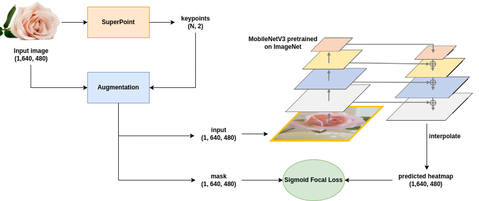
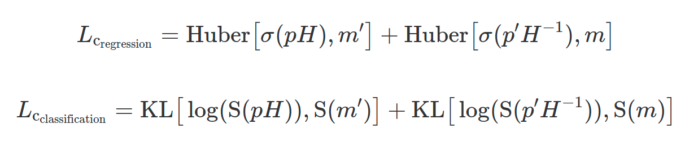
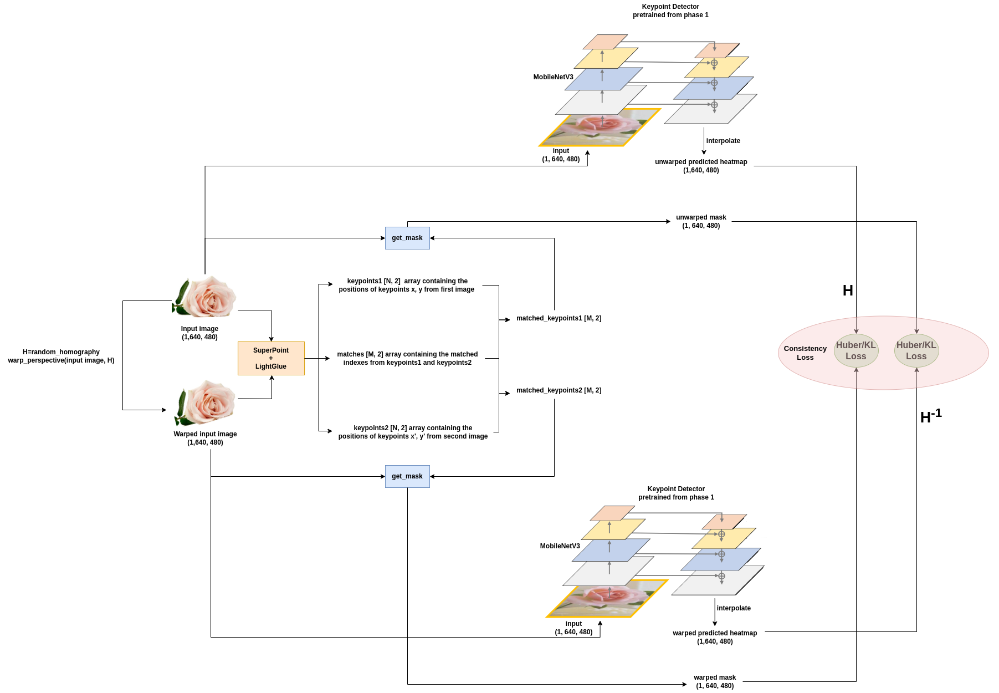

In this work we explored the “student-teacher” paradigm within the feature 
extraction and matching problem. The SuperPoint model acted as a source for 
keypoint labels in our experiment. We employed a pretrained MobileNetV3 backbone 
and augmented it with a Feature Pyramid Network (FPN) at four 
strategic locations. Feature maps resulted from a simplistic 
aggregation strategy, involving bilinear upscaling and summation, 
followed by a Conv2D layer to reduce the feature dimensionality to 
one channel, and bicubic interpolation to upscale the output to a 
VGA resolution heatmap.

We pursued two distinct training methodologies:

* The first phase involved fine-tuning the backbone in conjunction with the FPN to cultivate a concept analogous to "keypointness," enhancing the richness of the feature maps. 
 
 
Training pipeline for the first phase:

* The second phase aimed to fine-tune the refined backbone from phase one. It incorporated label smoothing across a range of 0.1 to 0.9 and utilized a Gaussian filter to transform the binary masks into blob-like structures, preserving a maximum value of 0.9 while creating a gradient that tapers off to 0.1. The intent was to introduce both uncertainty and spatial cognition. Masks were created by aligning points between original and warped images using LightGlue. This phase was thought as a regression challenge, training concurrently on an image and its warped counterpart. A consistency loss was introduced to promote feature stability across successive frames, ensuring that predictions were robust to homography-induced perturbations. We experimented with the Huber loss for its balanced L1/L2 characteristics.
 
 
Lastly, we also tried to keep the problem as a finetuning classification task using KL-divergence, essentially treating the image as a probability distribution. 
 
 
The consistency loss can be mathematically defined as follows: 
 
 

 
 
where _p_, _p′_ denote the predictions for the original and warped images, _H_ is a homography, _m_, _m′_ are the corresponding ground truth masks, _σ_ is the sigmoid function, and _S_ is the softmax function.
 
 
Training pipeline for the second phase:

